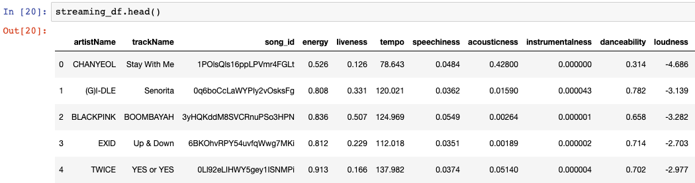
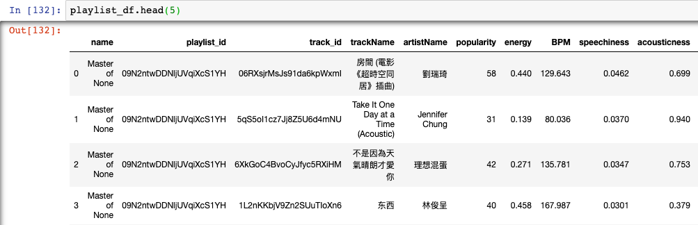
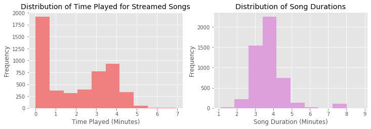
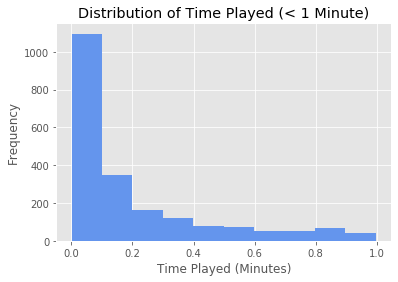
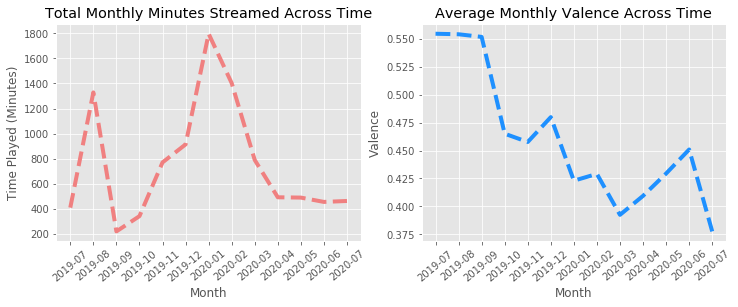
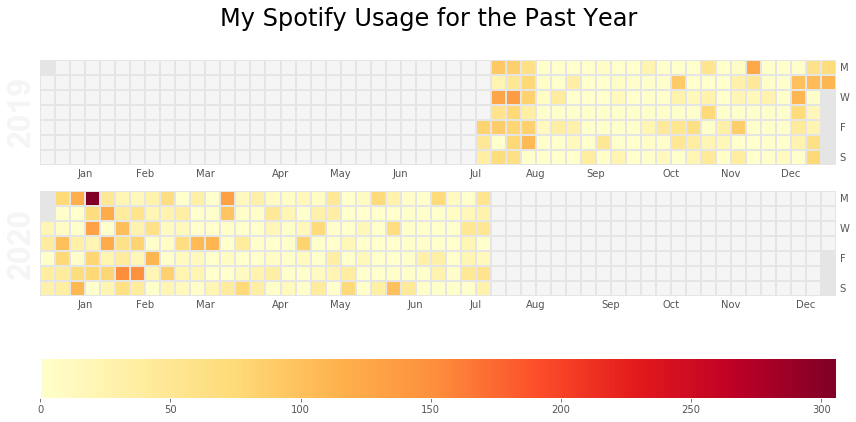
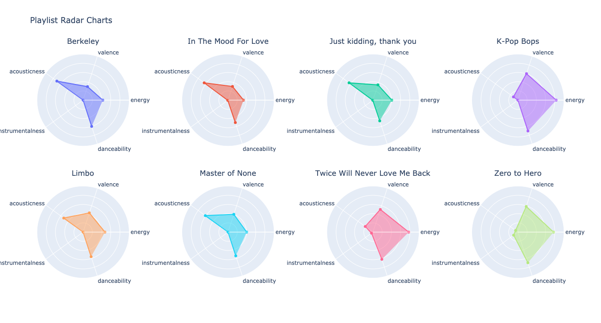

# Visualizing Spotify Streaming History

## Introduction

In this project, I will visualize my streaming history and playlists on Spotify and try to uncover interesting patterns. To do this, I connected to the Spotify API and downloaded some data from Spotify containing my streaming history (you can download yours [here](https://www.spotify.com/ca-en/account/privacy/)). Please refer to the [notebook](notebook.ipynb) see the associated code (interacting with API, data cleaning, visualization). In the end, I got two data frames, one for my streaming history and one for my playlists.

## Dataframes

First, I generated dataframes for the songs that I've streamed in the past year and for the songs in my playlists. Here's how the data frames look like:

 
 

For each track available on Spotify, the API contains features that quantify certain aural qualities. For example, the feature "danceability" captures how suitable a track is for dancing based on a combination of musical elements including tempo, rhythm stability, beat strength, and overall regularity. 

One important feature is "valence", which 	is "a measure from 0.0 to 1.0 describing the musical positiveness conveyed by a track." Tracks with high valence will be more "upbeat" while tracks with low valence tend to be more "negative".

For context, I mostly stream songs that were recommended to me through one of Spotify's playlists (e.g. Discover Weekly), and the songs in my playlists are the ones that I like the most.

## Key Findings

### Time Played for Songs I Streamed

Is a Spotify subscription really worth it in my case? A big draw of using Spotify is its algorithm that recommends songs to me. So, to answer the question, I will break down the problem into two parts:

1. Do I like the recommendations that I get?
2. How often do I actually use Spotify?

To answer the first question, I will use the variable "minutesPlayed" as a proxy. I usually skip over songs that I don't like, so if a song was recommended to me and I don't like it, I'll usually skip it or not listen to it for very long.

 

I'm actually quite surprised to see how different the distribution of minutes I streamed a song for is from the distribution of song durations. The latter is roughly normally distributed while the former is right skewed, which goes to show how often I skip over songs. Of the 5000 songs that I streamed in the past year, I listened to about 2000 of them for less than 30 seconds!

 

Looking just at the songs that I played for less than a minute, it appears that the vast majority of them were skipped after playing for less than 6 seconds! 

Perhaps I should reconsider my Spotify subscription! Skipping about 40\% of the songs recommended sounds a bit high to me, and I dislike these recommendations so much that I usually decide to skip in the first 6 seconds of the song. That being said, I can be somewhat picky with music (as you can probably imagine), so it's most likely not the algorithm's fault.

### Changes in Usage and Mood Across Time

There are two features I'm particularly interested in examining. In the aggregated data frame, I have the total monthly minutes played, as well as the average "valence" of the songs I played during that day. According to Spotify, valence is a feature that describes "the musical positiveness conveyed by a track". Valence ranges from 0-1, with 1 being more upbeat and 0 being more sad. By looking at valence over time, I can see how my mood changed throughout the past year.

 

Looking at the plots above, I can better understand my Spotify usage and mood across the previous 12 months. To give some context, I was working up until mid-August 2019, and quit my job to start graduate school in early September. 

Understandably, I saw a huge spike in time spent listening to music on Spotify in August, when I quit my job and had more free time on my hands. Then, when I started my graduate program, I hit an all time low (I remember being very busy re-adjusting to student life) and gradually increased my usage throughout the fall semester as I became more well-adjusted. January was my winter break, so naturally there was a spike in usage there, too, and it steadily decreased all the way to present day. It looks like in an average month (where I'm not too busy or too free), I stream songs for about 10 hours, so at \$10/month I'm only paying \$1/hour for Spotify's services.

The change in average monthly valence over time tells an interesting story. Clearly, my mood has been on a fairly steady decline over the past year. My mood was fairly positive from July to September, but I experienced a sharp drop in October (when the first wave of exams came around), and given how much Christmas music I listened to in December, I would have expected a much bigger uptick in December if it weren't for my final exams being around that time period too. There was another uptick in June (around the time I graduated from my program), but it was accompanied by a sharp drop once I started job searching!

### How Much Do I Actually Use Spotify?

After looking at my total monthly minutes spent on Spotify, I'm curious to see if there are confounding factors that lead to misrepresentation of my Spotify usage. One possibility is that there are was simply an outlier during certain months (e.g. August, January) that drove up the entire month's total usage, while my usage was normal for the rest of the month.

 

Looking at the resulting calendar heatmap, it appears that there weren't any particular days that drove up the entire month's usage. My Spotify usage in the past year was fairly uniform, while the months that had higher monthly usage (August, January) contained consistently higher usage across several days, not just one. This means that there weren't any outliers that led to misrepresentation of my Spotify usage in the previous section. 

### How Different Are My Playlists?

Next, I'd like to look at how unique my Spotify playlists are relative to each other. I only have 8 playlists, but each of them falls into one of two categories: nostalgia and theme. 

1. Nostalgia: These playlists contain songs that I listened to frequently during a period of my life. For example, the playlist titled "Berkeley" contains the music that I listened to when I was at Berkeley. 
2. Theme: These playlists contain songs that fall into a certain theme. For example, the playlist titled "Zero to Hero" is my workout playlist and contain upbeat songs that I listen to during exercise. 

The playlists that fall under "theme" should definitely be very different in terms of music, but just how different are they in terms of the features that Spotify tracks? To do this, I will create radar charts for each playlist, based on 5 features: acousticness, valence, energy, danceability, and instrumentalness.

 

Surprisingly, all of my "nostalgia" playlists follow the same general shape! They don't contain many instrumental (i.e. no lyrics) music, have low valence and energy, are highly acoustic, and have medium danceability. This means that throughout the years, my tastes in music have stayed consistent!

Similarly, my "theme" playlists follow the same shape. For context, the playlist "K-pop bops" contains Korean pop music and the playlist "Zero to Hero" contains workout music. These playlists tend to be high energy, highly danceable, have medium valence, and low acousticness and instrumentalness. This is to be expected, since these are the playlists that I listen to during long drives and tough workouts!

## Conclusion

Overall, I learned that while my music-listening mood can fluctuate in the short term based on life events (ex. adjusting to a new environment, exams, holidays, etc), my tastes in music have generally stayed consistent throughout the years, and the songs that I like the most (i.e. the ones I save to my playlists) tend to have the same musical qualities on average. 

That being said, it appears that I actually don't like a majority of the songs that Spotify recommends to me. In fact, I dislike them enough to skip 40\% of them in less than 30 seconds (and a vast majority of those 40\% in less than 6 seconds)! Given this information, and the fact that I only use Spotify for about 10 hours a month on average, maybe it's time to reconsider my subscription!

## Bonus: Learning My Music Preferences

Since I noticed I didn't like most of the songs that were recommended to me and that the music that I save to my playlists tend to have the same traits on average, I tried to build my own model to figure out which songs I'll like. For simplicity, and since I'd like to try out more Spotify-generated playlists, I used a dataset containing songs from the Spotify playlist "Warm Fuzzy Feeling" and used my model to try to "pick out" which songs in the 80+ song playlist I'll like. After fitting gradient boosting classifier and neural network models, I chose to use the gradient boosting model, which gave me 30 or so recommendations.

 

Setting aside any potential biases (e.g. the [IKEA effect](https://www.hbs.edu/faculty/Publication\%20Files/11-091.pdf)), I actually really enjoyed most of the songs that my model picked out. While not all of them ended up in one of my playlists, I ended up adding 7 of the 30 or so recommended songs. While the final model that I chose only had a test accuracy of about 75\%, almost all of the errors were false positives (i.e. songs I didn't like being classified as a song that I liked), which is certainly better than failing to detect a song that I actually liked, given how hard it is for me to like a song. Overall, this was a fun exercise in applying machine learning to something practical and I definitely plan to use this model for other pre-made playlists to scout out songs that I'll potentially enjoy.
